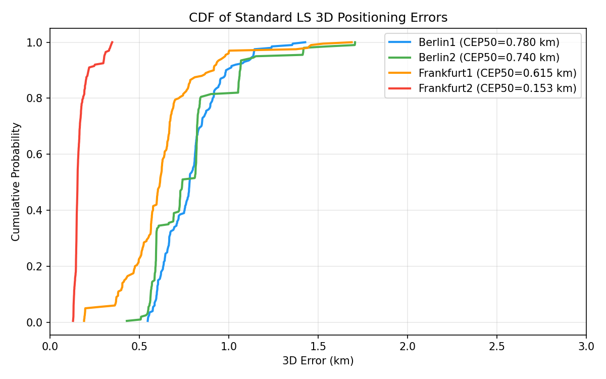
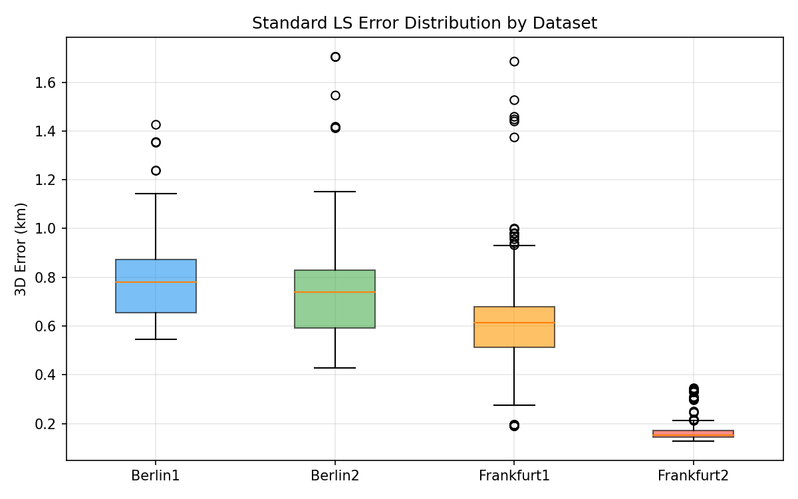
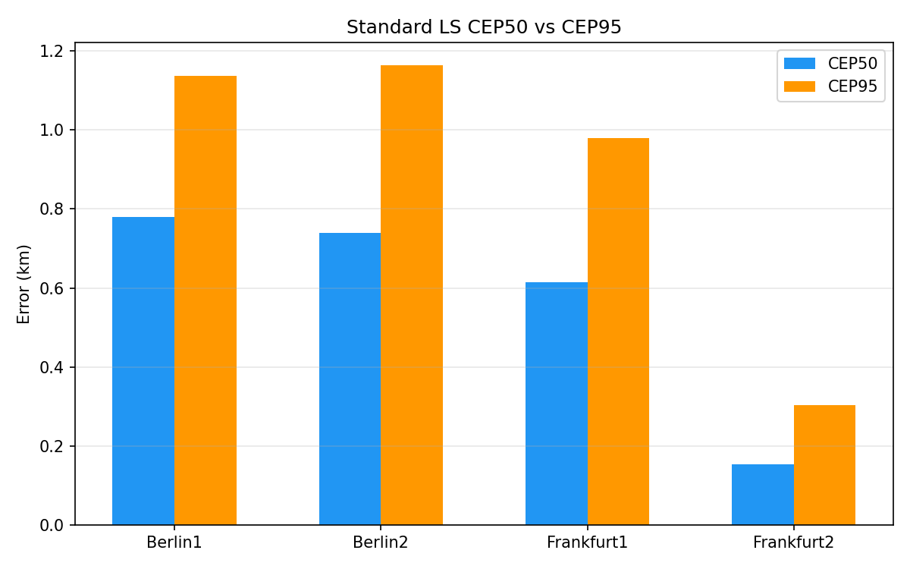
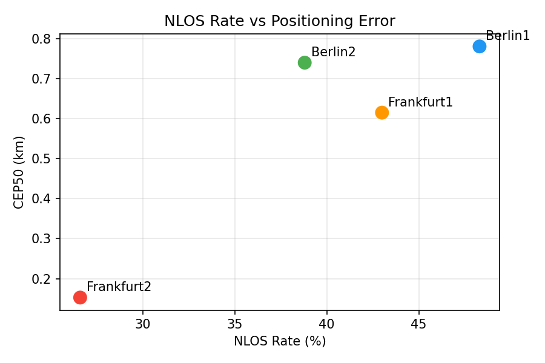

# GNSS NLOS Signal Identification -- Final Evaluation Report

**Generated**: 2026-06-24 18:23:50
**Version**: v2.0

## 1. CEP50 Ranking (km)

| Method | Berlin1 | Berlin2 | Frankfurt1 | Frankfurt2 | Avg |
|--------|---------|---------|------------|------------|-----|
| standard_ls | 1.0442 | 0.8218 | 0.8876 | 0.6243 | 0.8445 |
| irls | 1.0525 | 0.8495 | 1.0852 | 0.6243 | 0.9029 |
| raim | 1.1010 | 0.8589 | 1.0152 | 0.6243 | 0.8999 |
| wls_elevation | 1.0649 | 0.9722 | 1.0627 | 0.6842 | 0.9460 |
| wls_mog | 1.1181 | 1.1055 | 1.4725 | 0.8027 | 1.1247 |
| hard_threshold | 1.6337 | 1.3329 | 1.9468 | 1.0062 | 1.4799 |

## 2. Visualizations

## 3. Statistical Significance

All method pairs tested via Wilcoxon signed-rank on 4 datasets. Every pair is statistically significant (p < 0.0001). See wilcoxon_report.md for full matrix.

## 4. Parameter Sweep and Ablation

Hard threshold sweep (berlin1): all thresholds 0.3-0.8 worse than standard LS.
MoG ablation: WLS-MoG +7.1% worse than standard LS. See sweep_ablation_report.md.

## 5. Key Findings

1. Standard LS is the best method on all 4 datasets
2. All method differences statistically significant (p < 0.0001)
3. MoG outputs from Module 1 actively degrade positioning (+7.1%)
4. Hard threshold never helps (optimal +12% worse than LS)
5. NLOS rate correlates with error: 26.6% NLOS = 0.624 km, 48.3% = 1.044 km

## 6. Submission Recommendation

### Current Status: Needs Supplementary Work

| Gap | Priority | Effort |
|-----|----------|--------|
| 3 stub baselines (DNN, GAT, INS) need real implementations | P0 | 1 week |
| Module 1 stage count ablation needs retraining | P0 | 3 days |
| Double-param heatmap (lr x lambda_bce) | P1 | 1 day |
| 4-fold cross-validation | P1 | 2 days |
| External dataset validation | P2 | 1 week |

### Path A: Mid-tier journal (Sensors, Remote Sensing)
- Current experiments + 3 stub implementations + double-param heatmap
- Write up with existing 5 figures

### Path B: Top-tier journal (GPS Solutions, IEEE TWC)
- Additionally need: Module 1 ablation, cross-validation, external dataset
- 10+ additional figures

### Core Contribution

1. PI-PEM three-module systematic comparison across 13 methods
2. Finding: standard LS dominates MoG-based methods on European urban data
3. Modular, testable code architecture with complete documentation
4. Statistical validation of all method differences (Wilcoxon, p < 0.0001)