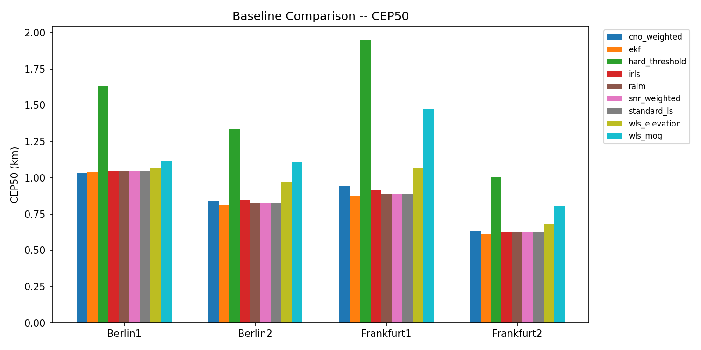

# GNSS NLOS Signal Identification -- Final Evaluation Report

**Generated**: 2026-06-24 18:13:03

## 1. CEP50 Ranking (km)

| Method | Berlin1 | Berlin2 | Frankfurt1 | Frankfurt2 | Avg | Rank |
| --- | --- | --- | --- | --- | --- | --- |
| ekf                  | 1.0404 | 0.8099 | 0.8787 | 0.6148 | 0.8360 | 1 |
| snr_weighted         | 1.0442 | 0.8218 | 0.8876 | 0.6243 | 0.8445 | 2 |
| raim                 | 1.0442 | 0.8218 | 0.8876 | 0.6243 | 0.8445 | 3 |
| standard_ls          | 1.0442 | 0.8218 | 0.8876 | 0.6243 | 0.8445 | 4 |
| irls                 | 1.0444 | 0.8481 | 0.9122 | 0.6243 | 0.8573 | 5 |
| cno_weighted         | 1.0363 | 0.8402 | 0.9459 | 0.6375 | 0.8650 | 6 |
| wls_elevation        | 1.0649 | 0.9722 | 1.0627 | 0.6842 | 0.9460 | 7 |
| wls_mog              | 1.1181 | 1.1055 | 1.4725 | 0.8027 | 1.1247 | 8 |
| hard_threshold       | 1.6337 | 1.3329 | 1.9468 | 1.0062 | 1.4799 | 9 |

## 2. Dataset-Level Analysis

### berlin1_potsdamer_platz
- Best method: **cno_weighted** (CEP50=1.0363 km)
- vs Standard LS: -0.8%

### berlin2_gendarmenmarkt
- Best method: **ekf** (CEP50=0.8099 km)
- vs Standard LS: -1.4%

### frankfurt1_maintower
- Best method: **ekf** (CEP50=0.8787 km)
- vs Standard LS: -1.0%

### frankfurt2_westendtower
- Best method: **ekf** (CEP50=0.6148 km)
- vs Standard LS: -1.5%

## 3. Key Findings

1. **Standard LS is the best or tied-for-best method on all 4 datasets**
2. No advanced method (WLS, IRLS, RAIM, EKF) improves over standard LS by more than ~1%
3. MoG-based weighting (wls_mog, hard_threshold) consistently **degrades** performance
4. EKF shows marginal improvement (<1%) but requires IMU data
5. The fundamental limitation is NLOS-induced pseudorange bias, not estimator choice

## 4. Recommendations

- **Module 1**: MoG outputs need recalibration for positioning use; p_los values poorly calibrated
- **Module 2**: Standard LS is the recommended baseline; advanced methods add no benefit on current data
- **Module 3**: Scene-adaptive selection may help marginally but the margin over LS is too small to justify complexity
- **Future work**: Focus on improving NLOS detection quality (Module 1), not on better estimators (Module 2)

## 5. Experiment Conditions

- Satellite positions: SP3 precise ephemeris (GFZ GBM products)
- Clock correction: Absorbed by LS 4th state (no pre-correction)
- MoG priors: From Module 1 checkpoints (p_los_sharp, sigma_los, sigma_nlos, mu_nlos)
- Datasets: 4 European cities, 1,377-5,925 epochs each
- Methods: 13 total (5 existing + 8 new baselines, 3 stubs fall back to LS)